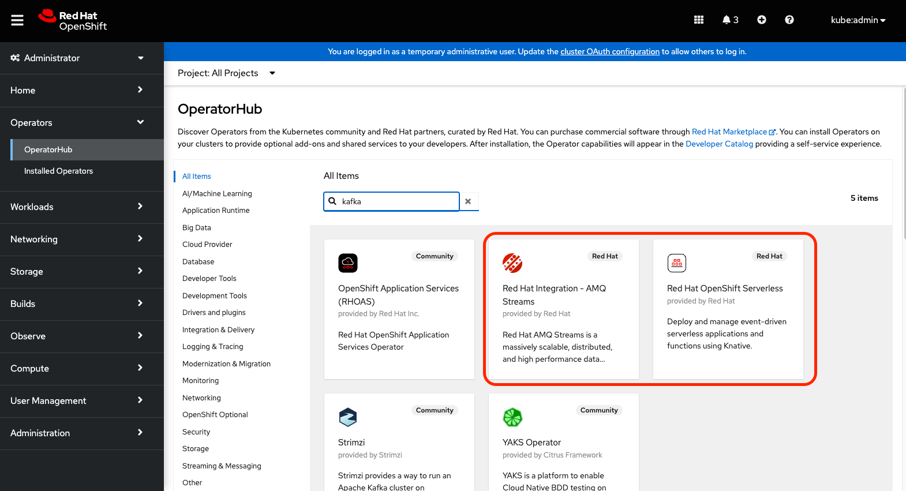
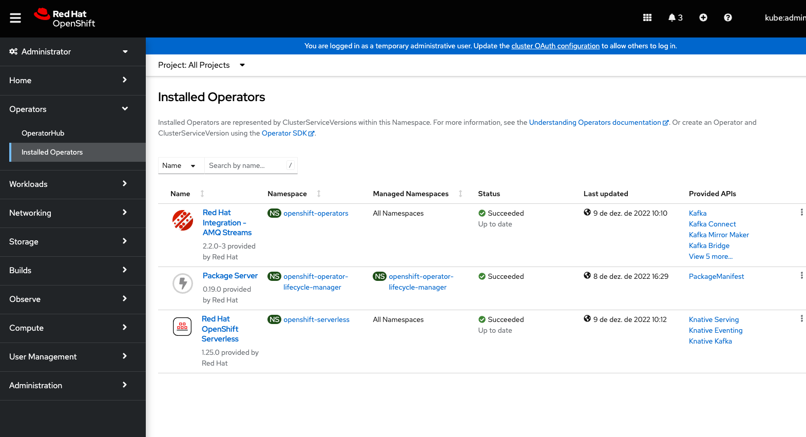

# OpenShift Serverless Workshop
This repo contains the lab guides for a workshop on OpenShift Serverless (Knative). These labs have been designed to work within an OpenShift Homeroom deployment. The TL;DR of homeroom is that we build all these labs into a website, stuff that in a container, and deploy that container to the OpenShift cluster that the workshop attendees are using. This lets us show instructions side-by-side with the OpenShift webconsole and CLI terminal.

## How To Provision

### Order from RHPDS

In the catalog, navigate to [All Services] -> [Openshift Workshop] -> [OpenShift 4 ML Serverless]

Make sure to set select Size "Small" or "Large".  Also set the "Users" count with the expected number of participants in your workshop.

If you are an admin, [you can find the workshop guide here](https://docs.google.com/document/d/12JdE4M9MC7n9nCnrhFwy5U2cAUyfBxs_Mnk3Fm2u7Qk/edit)

## Access info for the workshop
> Make sure you provisioned the workshop using RHPDS or [ran the AgnosticD role](./README-AgnosticD.md) on the cluster.

Give this URL to workshop attendees: 
```
echo https://username-distribution-homeroom.$CLUSTER_SUBDOMAIN
```

They'll need to enter a valid email address and the workshop password specified by the `LAB_USER_ACCESS_TOKEN` environment variable, for which the default is **redhatlabs**.  Once logged in, they'll be given a user account and a link to the workshop.

You can perform administrative actions by visiting `/admin` in the `username-distribution` app. You'll need to enter `admin` as a username and the value of the `LAB_ADMIN_PASS` environment variable, for which the default is **pleasechangethis**, as a password.

For direct access to the workshop, you can navigate to:
>`echo https://serverless-workshop-homeroom.$CLUSTER_SUBDOMAIN`


## Clean Up
Delete the RHPDS cluster once you are done running the workshop


### Using your own cluster
## Pre-requisites
* Kafka Operator Installed
* Kafka cluster created with name "my-cluster" on kafka namespace
* Authentication using httpasswd with users already created
* Serverless operator created with Serving and Eventing instances created
* Create roles and rolebindings accordingly to the number of users (ansible)

## Preparation
### Install the Kafka and Serverless Operators


On installation you can safely accept all default options. After install, you probably will have the following:




---

If you want to contribute and help develop for this workshop, please [see developer instructions here](./README-Developers.md)
