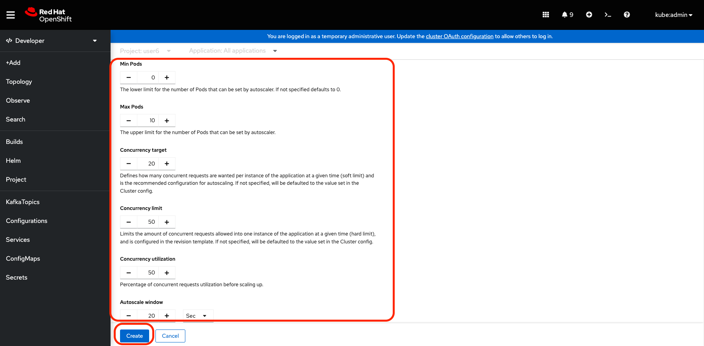
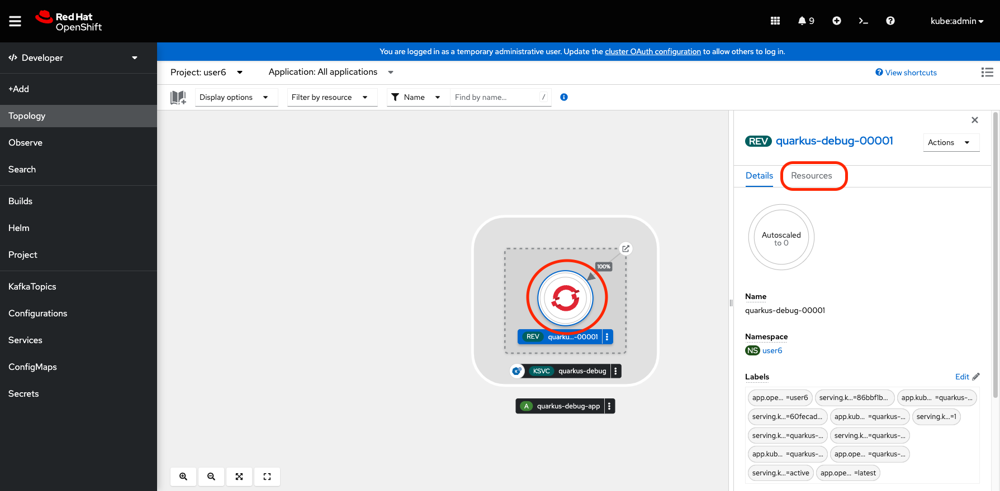
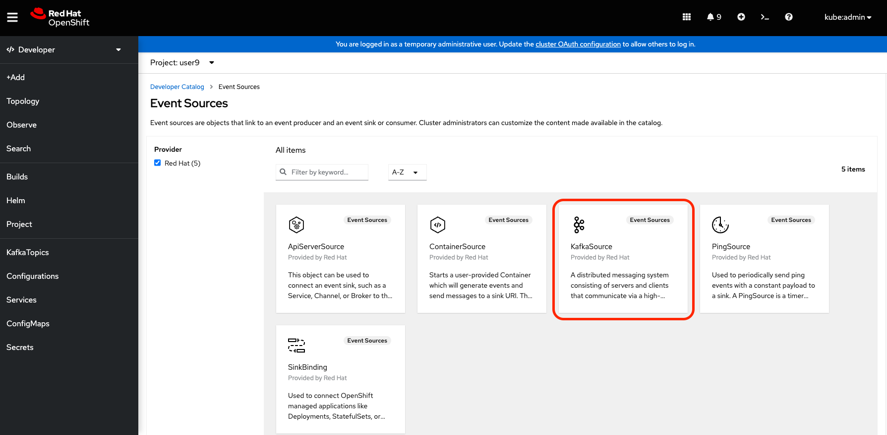
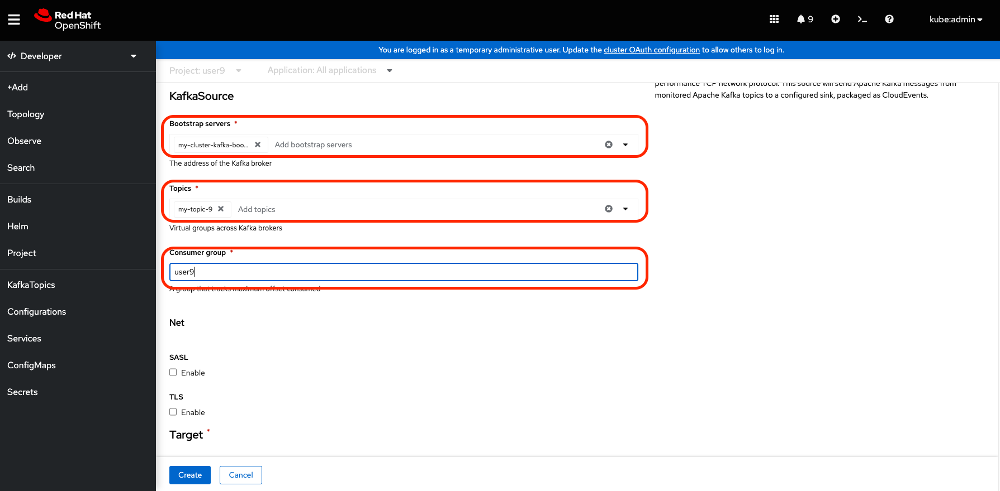

# Using the Console
The same work you have done in the previous exercises could be done using a few steps on Console.

## Deploy Service

### Access the console in a new window:

https://console-openshift-console.%cluster_subdomain%/ 

### Use Developer view and select your project

First, change the console interface to interact in the Developer view:


Now, click on "Topology" and select your project %username%


### Deploy the app using serverless

You have now freedoom to work. Below we will suggest some apps or images, but if you want to do for your own image or project, just do it!

Well, to place an app running on OpenShift, you need just a few steps. For Serverless, the steps are exaclty te same, however you just choose to run as serverless. OpenShift do all the "boring" work alone. You just need to code.

The app we will use is an docker image. To place the app running, just do the following steps:

1) Click in "Add Page" or in the "+Add" on the left panel
   


2) This page offers many ways to add application to OpenShift. In our example, we will use the deploy of an already existant image. So, click on "Container images".


3) On the first section, in "Image name from external registry" type `luszczynski/quarkus-debug`. 
   

4) Now, we will chose this deployment to use "Serverless Deployment". This will do all  you have done on previous exercises magically. 

   


5) You can also place some custom configurations, like, for example, "Scaling". This will enable to previously configure the behavior of the scaling up when your app needs to.

   

6) Place the following suggested thresholds and click "Create":

   


### Check created resorces and access your app

OpenShift has now created all resources you need for your serverless deployment. It has created the Knative Service (KSVC), the Configurations (CFG), Revisions as well the Route to enable you to access the app.

To observe this objects, you can access the "Resources" tab on the detail view of your service in "Topology" section. To open the detail view, just click on the pod with OpenShift symbol:

   

To access your app, just click on the "Location" route at the end of the view:


   

   

You can back to the console, in Topology, and you will noticed that the pod automatically has scaled up to serve. Wait for about 30 seconds to notice the scale down.

   


### Run ab or k6 to see the auto-scale working

Ask for your instructor to do some stress test and check the scale-up/down of the application.

## Use the same KafkaSource for Eventing testing

### Create the Kafka Source Through "+Add" Button

1) Add the Kafka Source 

   

   


2) Configure the Kafka Source to get events when your topic receive messages




3) Produce messages on your topic and watch for the serverless scaling up

In one terminal run:

```execute
oc run kafka-producer -ti --image=strimzi/kafka:0.19.0-kafka-2.5.0 --rm=true --restart=Never -- bin/kafka-console-producer.sh --broker-list my-cluster-kafka-bootstrap.kafka:9092 --topic my-topic-$USER_NUMBER
```


## Summary
In this lab you saw that it could be even easier to place a serverless app up and running on OpenShift. The Console also help on easier troubleshooting and even for operating. 
