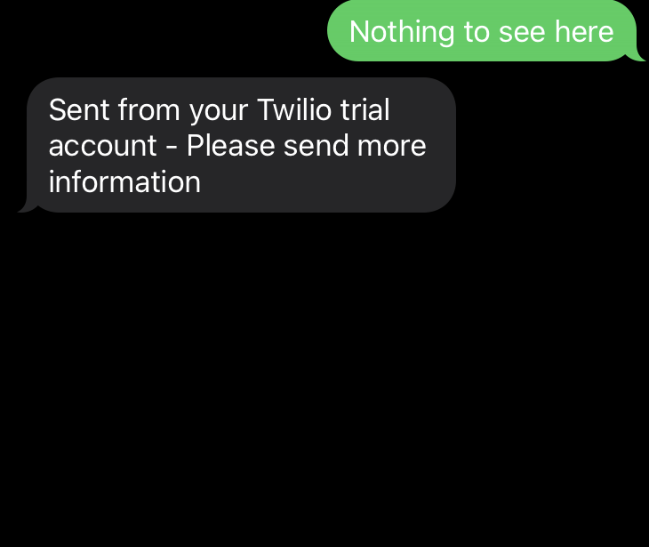
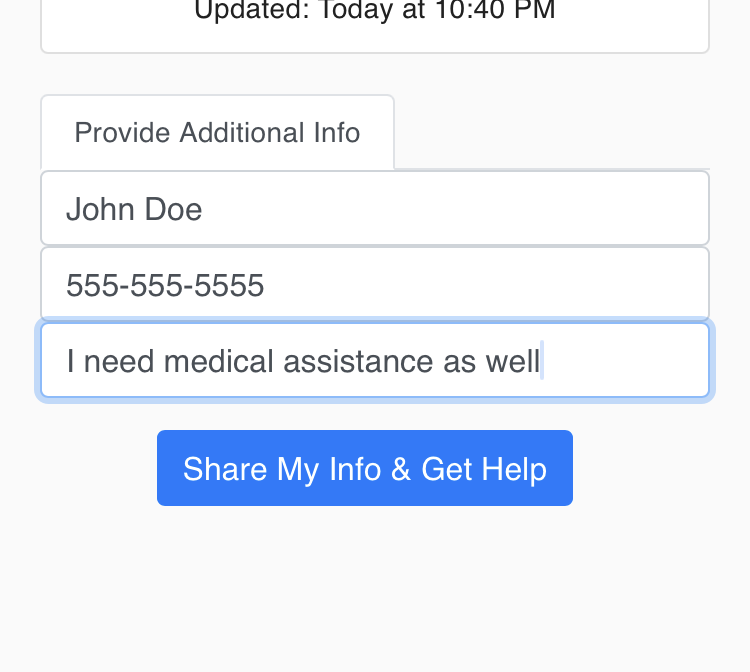

# Integrate with Lifeline

The final piece to this architecture is the [Lifeline][1] application.  After a person texts your NLP Prediction Service, the model verifies if the message describes a legitimate disaster.  If verification succeeds, the service should reply to the user with a link to a mobile website to ask for help.  

That's where Lifeline comes in.  Lifeline is a React based web application in which users can quickly share their location and request help from Emergency Response.  In this lab, you will deploy Lifeline on OpenShift and connect it with the NLP Prediction Service.

## Setup

Deploy Lifeline:

```execute
oc new-app nodeshift/ubi8-s2i-web-app:latest~https://github.com/RedHatGov/serverless-workshop-code.git  \
--name=lifeline --context-dir=lifeline
```

Wait a few minutes until Lifeline is running:

```execute
oc get pods -l deployment=lifeline
```

Output (sample):

```
NAME                        READY   STATUS      RESTARTS   AGE
lifeline-xxxxxxxxxx-xxxxx   1/1     Running     0          61s
```

Create an external route to Lifeline:
> Note: TLS is required for geo-location to work in the application, so we use edge termination

```execute
oc create route edge --service=lifeline
```

Set the Lifeline URL:

```execute
LIFELINE_URL=$(oc get route lifeline --template='https://{{.spec.host}}')
echo $LIFELINE_URL
```

Now we're ready to connect the NLP Prediction Service with Lifeline.  The code in the prediction service is already setup to reply to the user with a link to Lifeline.  All we need to do is pass in a new environment variable called `LIFELINE_URL` to the prediction service.

Update the prediction service with the Lifeline environment variable:

```execute
kn service update prediction --env LIFELINE_URL=$LIFELINE_URL
```

Wait until the service is updated.  

Set the prediction endpoint:

```execute
PREDICTION_URL=$(oc get route.serving.knative.dev prediction --template='{{.status.url}}/predict')
```

Let's see what changed.  Send a sample request:

```execute
curl -X POST -d 'Body=nothing to see here' $PREDICTION_URL | xmllint --format -
```

Output (sample):

```
<?xml version="1.0" encoding="UTF-8"?>
<Response>
  <Message>Please send more information</Message>
</Response>
```

Send another sample request:

```execute
curl -X POST -d 'Body=massive flooding and thunderstorms taking place' $PREDICTION_URL | xmllint --format -
```

Output (sample):

```
<?xml version="1.0" encoding="UTF-8"?>
<Response>
  <Message>Please click on this link: https://lifeline-userx.apps.cluster-xxxx.xxxx.example.opentlc.com</Message>
</Response>
```

The prediction service now responds with a link to the Lifeline application if the model determines the message is legitimate.

## Test

It's time for one final end-to-end test of the user experience!  Text your Twilio phone number using your personal mobile device.

Text 'Nothing to see here' and you should see:



Text 'Massive flooding and thunderstorms taking place' and you should see:


> Note: If you don't see a response, try sending the message again.  Twilio has a timeout window that is not configurable.

Click the link on your mobile device.  Allow the website to access your location if asked by your browser.  You will be presented with the Lifeline application:

> Note: Your settings must not be actively denying GPS access for geo-location to work on mobile


The application will automatically capture your geo-location.  Scroll down and enter additional information.  For example:



Click 'Share My Info & Get Help' once you are ready.  You should get a response that help is on the way!


## Summary

You deployed the Lifeline application on OpenShift and connected it to the NLP Prediction Service.  This completed the end user experience.  Now, your users can text a phone number, receive a link to Lifeline, and request for help directly from the Lifeline application.

[1]: https://github.com/RedHatGov/serverless-workshop-code/tree/main/lifeline